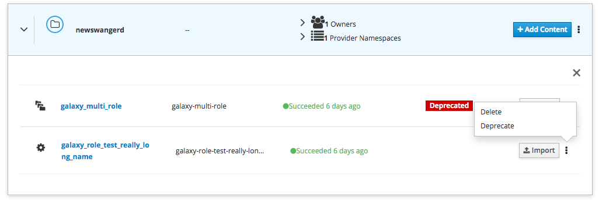
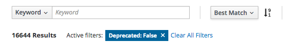

.. deprecation:

*******************
Deprecating Content
*******************

You can deprecate repositories that you own from the 'My Content' page. To do
this select the namespace that contains the repository, and select the
'Deprecate' option in the dropdown menu next to the import button. Repos
can be undeprecated by selecting 'Un-Deprecate' from the same dropdown menu.

.. note::
    Currently deprecation is only supported at the repository level. At the moment
    it is impossible to deprecate a single item in a multi-content repository.

Deprecated content is marked with the deprecated tag on the Search, My Content,
Author and Content Detail pages. Deprecated content is filtered out of search
results by default. It is still possible to find and use deprecated content by
removing the search filter for 'Deprecated: False' on the search page, however
using deprecated content will result in a warning.

