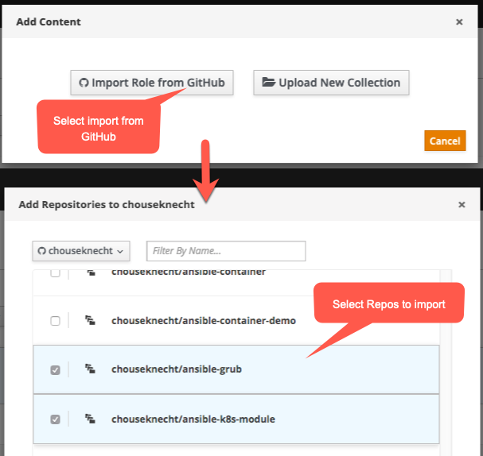

.. _importing_content:

*****************
Importing Content
*****************

.. contents:: Topics

This topic describes how to import Ansible content into the public Galaxy web site.

.. _import_get_started:

Getting Started
===============

At present, Galaxy only imports content from `GitHub <https://github.com>`_, and importing content to the `public Galaxy server </>`_
requires authentication using a GitHub account.

Logging In
----------

Before you can import content, you'll need to first authenticate with the Galaxy server using your GitHub account. Start by clicking
the *Login* link, as shown below:

.. image:: login-01.png

Next, click the GitHub logo, as indicated in the image below:

.. image:: login-02.png

The first time you authenticate using your GitHub credentials, GitHub will present a page similar to the following asking you to grant
permissions to Galaxy:

.. image:: login-03.png

Galaxy requires access to your email address, in case an admin needs to reach out to you, read-write access to public repositories,
using the ``public_repo`` scope, and read access to your organizations and teams. Galaxy will never write or commit anything to a
repository. It needs access to public repositories so that it can read commits and the list of collaborators.

Be sure to click the *Grant* button next to each organization that contains Ansible content you want to import into Galaxy. The following
image shows the *Grant* button, after clicking it, you'll see a green checkmark to the right of the ogranization name, indicating that
Galaxy can access public repositories within the organization:

.. image:: login-04.png

After granting access to each organization, click the green button at the bottom of the page to authorize Galaxy to access your peronsal
GitHub namespace and continue, as indicated in the image below:

.. image:: login-05.png

Once you complete the above, you'll be taken back to the Galaxy web site, where you'll see the *My Content* and *My Imports* menu options
available, as depicted below:

.. image:: login-06.png

Updating GitHub Permissions
---------------------------

If you need to change the permission settings for a GitHub organization, log into `GitHub <https://github.com>`_, and navigate to
*Settings*, and *Applications*. Click the *Authorized Oauth Apps* tab, as depicted below:

.. image:: update-01.png

Next, click the name of the Ansible Galaxy app, as indicated in the image below. This will take you to the permissions page for the
app, where you can Grant permissions to individual organizations:

.. image:: update-02.png

As the image below indicats, click the *Grant* button next to each organization that Galaxy should have read access to. This will allow
Galaxy to import content from the organization:

.. image:: update-03.png

If you wish to revoke Galaxy access to an organization, click the *Revoke* button. This will remove all permissions. To reset permissions,
logout and log back into Galaxy using your GitHub credentials, and GitHub will present the permissions page, where you can grant access
to your organizations, and authorize access to your GitHub namespace, as discussed above in :ref:`import_get_started`.

Web Interface
=============

Before importing content into Galaxy, you must first authenticate using your GitHub credentials as discussed in :ref:`import_get_started`.

Go to `My Content </my-content/namespaces>`_, where you will see one or more Galaxy namespaces, as depected in the image below. The first
time you logged in, Galaxy created a namespace matching your GitHub namespace, so you should see at least one namespace. You'll
import content from GitHub into a Galaxy namespace.

.. image:: mycontent-01.png

Click the expansion arrow, as depicted below, to view any repositories associated with the namespace. If this is your first time accessing
Galaxy, then there likely aren't any repositories associated with it yet.

.. image:: mycontent-02.png

Adding Repositories
-------------------

To add GitHub repositories to the namespace, click the *Add Content* button, as depicted in the image below:

.. image:: mycontent-03.png

In the dialog box, as shown in the image below, choose the repositories you wish to add, and click the *OK* button to add them:

Galaxy will attempt to import each of the selected repositories, and as shown in the next image, the status of each import will be
updated every few seconds.

.. image:: mycontent-05.png

The import process analyzes metadata and performs static analysis on the repository contents, so it's quite possible it will find
an issue that prevents the content from bein imported. If this happens, and the status of the import shows *Failed*, click on the
import status message, as shown below, to view more details:

.. image:: mycontent-06.png

Clicking the status message will take you to My Imports, and show the full details of the import process. Below is sample output
from a failed import, where several issues were found by YamlLint:

.. image:: myimports-01.png

With the issue resolved, restart the import process by clicking the import button near the top-right corner of My Imports, as shown
below:

You can also restart the import by clicking the import button on My Content for the repository, as shown here:

.. image:: mycontent-07.png

Adding GitHub Organizations
---------------------------

Content from multiple GitHub organizations can be imported into a Galaxy Namespace. To add additional organizations, on My Content,
expand the menu for the Namespace, and choose *Edit Properties*, as shown here:

.. image:: mycontent-08.png

On the next page, scroll to the bottom of the page, where a list of available GitHub organizations is displayed. It's labeled
*Provider Namespaces*, and represents the list of namespaces or ogranizations you have access to in GitHub.

As indicated in the image below, click on an organization to select it and add it to the *Selected Provider Namespaces* on the right.
Clicking the *X* next to the name on the right will remove it.

.. image:: mycontent-09.png

At the top of the list of Provider Namespace is a search box. If you don't see an organization listed, try typing the name in the
box and pressing Enter.

Click the *Save* button at the bottom of the page to update the Namespace with your changes, as shown below:

.. image:: mycontent-10.png

Adding Administrators
---------------------

Multiple Galaxy users can own or have administration rights to a Namespace. To add additional owners to a Namespace, expand the Namespace
menu on My Content, and choose *Edit Properties*, as depicted below:

.. image:: mycontent-11.png

On the next page, scroll toward the bottom of the page, where a list of *Namespace Owners* appears. Use the search box to find
specific users by Galaxy username. Click on a user to add them to the list of *Selected Galaxy Users* on the right, or click the *X*
next to the username to remove them from the list. The image below provides an example:

.. image:: mycontent-12.png

Anyone in the list of owners can import content into the Namespace. They can also modify properties of the Namespace, remove content,
and disable the Namespace altogether, removing content from search results, and making it unavailable for download.

After making changes to the list of owners, click the *Save* button at the bottom of the page to update the Namespace with your
changes, as shown below:

.. image:: mycontent-10.png

Namespace Limitations
=====================

Namespace names in Galaxy are limited to lowercase word characters (i.e., a-z, 0-9) and '_', must have a minimum length of 2
characters, and cannot start with an '_'.

No other characters are allowed, including '.', '-', and space. The first time you log into Galaxy, the server will create a Namespace
for you, if one does not already exist, by converting your username to lowercase, and replacing any '-' characters with '_'.

Content Name Limitations
========================

Prior to Galaxy v3.0, the import process would alter the GitHub repository name to create the content name. Specifically, it would
apply a regular expression, and remove 'ansible-' and 'role-' from the repository name. For example, a repository name of
*ansible-role-apache* would become *apache*.

Starting in v3.0, Galaxy no longer perform this calculation. Instead, the default content name is the unaltered repository name, with a
couple minor exceptions, including: converting the name to all lowercase, and replacing any '-' or '.' characters with '_'.

To override the default name for an Ansible role, set the ``role_name`` attribute in the role ``meta/main.yml`` file. The following snipet
from a ``meta/main.yml`` file provides an example of setting the *role_name* attribute:

.. code-block:: yaml

  galaxy_info:
    role_name: apache
    description: Install the httpd service
    company: Acme, Inc.

To override the default name for an APB, set the *name* attribute in the ``apb.yml`` metadata file. The following snipet from an
``apb.yml`` file provides an example of setting the *name* attribute:

.. code-block:: yaml

   version: 1.0
   name: virtualization
   description: KubeVirt installer
   bindable: False
   async: optional
   metadata:
     displayName: Kubevirt
     longDescription: |
       KubeVirt enables the migration of existing virtualized workloads directly into the development workflows supported by Kubernetes.
       This provides a path to more rapid application modernization by:
         - Supporting development of new microservice applications in containers that interact with existing virtualized applications.
         - Combining existing virtualized workloads with new container workloads on the same platform, thereby making it easier to decompose monolithic virtualized workloads into containers over time.
     documentationUrl: https://github.com/kubevirt/kubevirt/blob/master/README.md
     imageUrl: https://cdn.pbrd.co/images/H5Gutd7.png
     providerDisplayName: "Red Hat, Inc."

Since the *name* attribute is set to 'virtualization' in the above example, Galaxy will import the APB with the name 'virtualization',
rather than the repository name.

.. note::

    Content names are limited to lowercase word characters (i.e., a-z, 0-9) and '_'. No special characters are allowed, including '.',
    '-', and space. During import, any '.' and '-' characters contained in the repository name or role_name will be replaced with '_'.

.. note::

    Setting the value of *role_name* on an existing role will change the name of the role by converting it
    to lowercase, and translating '-'  and '.' to '_'. If the name of an existing role should not be
    altered, don't set the value of *role_name*.

Content Versions
================

Galaxy supports versioning content through git tags that match the `Semantic Version format <https://semver.org>`_.

For more on creating tags, view :ref:`versioning_content`.

Travis CI
=========

After logging into Galaxy for the first time, you can initiate content imports directly from Travis. In your ``.travis.yml`` file,
add a webhook to the notifications section, as shown below:

.. code-block:: yaml

    ---
    language: python
    python: "2.7"

    # Use the new container infrastructure
    sudo: false

    # Install ansible
    addons:
      apt:
        packages:
        - python-pip

    install:
      # Install ansible
      - pip install ansible

      # Check ansible version
      - ansible --version

      # Create ansible.cfg with correct roles_path
      - printf '[defaults]\nroles_path=../' >ansible.cfg

    script:
      # Basic role syntax check
      - ansible-playbook tests/test.yml -i tests/inventory --syntax-check

    notifications:
      webhooks: https://galaxy.ansible.com/api/v1/notifications/

A ``git push`` to the github branch that was previously imported (the default branch unless specified
differently using the ``ansible-galaxy`` command-line interface) will trigger a re-import.

If you give the webhook a ``branch`` query parameter, it will only trigger an import with pushes to that branch.
For example a forked repo with a PR ``my_feature`` branch will not trigger an import with this:

.. code-block:: yaml

    notifications:
      webhooks: https://galaxy.ansible.com/api/v1/notifications/?branch=master

A ``git push`` of a git tag to the repository will always trigger an import.

.. note::

   You must first log into Galaxy to create a Namespace and associate GitHub organizations with the
   Namespace. If a Namespace does not exist, or the GitHub organization where the content exists is not
   associated with a Namespace, then Galaxy will not know how to import the content.
