.. _galaxy_search:

***********************
Finding Ansible Content
***********************

.. contents:: Topics

This topic describes how to use the Galaxy web site to find Ansible content.

.. _galaxy_search_page:

Search
======

The easiest way to find the right Ansible content for your automation project, is to visit the `Search page </search>`_. 

At the top of the Search page, you'll find a filter toolbar that looks similar to the following:

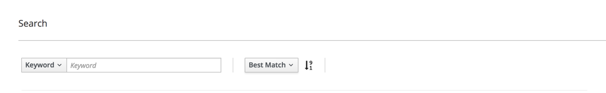

To begin filtering, choose one of the options from the dropdown. The filter dropdown is highlighted in the following image:

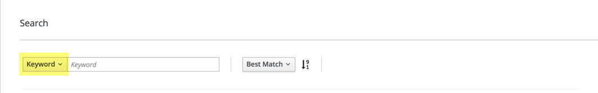

The dropdown is set to 'Keyword' by default. Click on it to see a list of available filters, as depicted below:

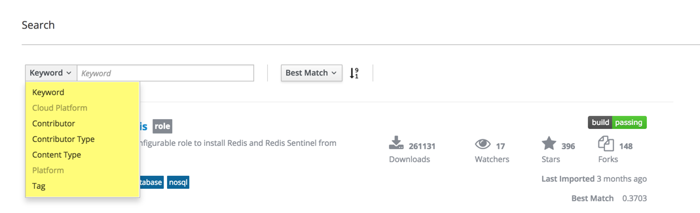

Filter options
..............

Fromt from the dropdown, choose from one of the available filters, including:

Keyword
    Match words or phrases in README file text, content name, and content description. 

Cloud Platform
    Choose from available cloud providers, including: AWS, Google and Azure.

Contributor
    Name, or partial name, of a content author.

Contributor Type
    Choose from either *Community* or *Vendor*. For example, to view only content that's been contributed by community members, and
    exclude any content contributed by vendors, select *Community*. 

Content Type
    Choose from the available content types, including: Ansible Playbook Bundle (APB), and Role.

Platform
    Choose from the list of operating system platforms.

Tag
    Match tag values used to categorize Ansible content, examples include: database, networking, monitoring, mysql

Applying Filters
................

Filters that present a list of choices are automatically applied to the search after you choose a value from the list.
For example, setting the filter dropdown to *Content Type*, and then choosing *Role* from the list of options, will
immediately change the search results to include only Ansible roles.

For filters requiring a value, click the Enter key after typing the value in the input field. For example, choose *Tag*,
and then type *database* in the input field. To apply this filter, and update the search results, click the enter key. After
clicking the Enter key, the search results will update, showing on results that include a *database* tag.

Combining Filters
.................

Multiple filters can be combined to further narrow the list of search results. Each time a new filter is added, it appears
in the list of Active Filters, just under the filter toolbar. For example, the following image shows an Active Filters list that
includes: Content Type of Role, keyword *mysql*, and contributing author name *geerling*

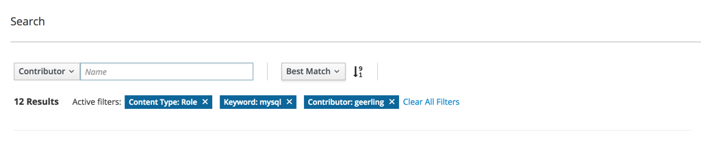

Returned results must match each filter. In other words, using the above example, all returned results will be Ansible roles, 
and have the word *mysql* in either the README text, name or title, and have an author name containing *geerling*.

Removing Filters
................

As depicted below, click the *X* in the right corner of an Active Filter to remove it. As filters are removed, search results are
immediately updated. 

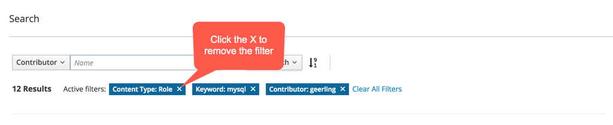

To remove all filters, click the *Clear All Filters* text.

Search Result Order
...................

The search order defaults to *Best Match*, but can be changed to one of several options. Click the dropdown list to
see the available options, as demonstrated below:

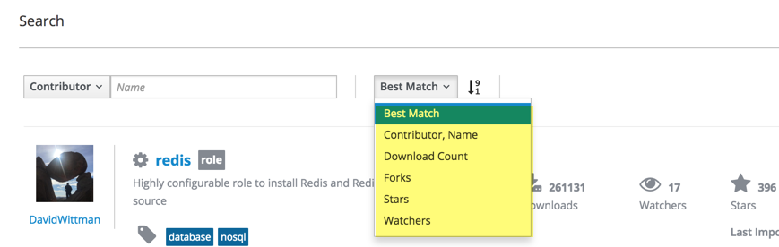

*Best Match* is a weighted score calculated by the search engine. It combines the number of matched filters along with the number of times
the item has been downloaded. Content items having the highest match rate to the active filtes will appear at the top of the list. Of those
items, the ones that have been downloaded the most will be ranked first. Having the most matches to the active filters, and the highest
number of downloads determines which item is ranked first.

In addition to *Best Match*, the following sort options are also available:

Contributor, Name
    Sort results alphabetically according to the contributing author name, and the name of the content item.

Download Contributor
    Sort results by the number of times each has been downloaded.

Forks
    Sort results based on the number of times the item's GitHub repository has been forked.

Stars
    Sort results based on the number of stars the item's GitHub repository has received.

Watches
    Sort results based on the number of GitHub users watching the item's repository.

Choosing one of the above options overrides the default of *Best Match*, and immediately re-orders the search results.

Reversing the Order
;;;;;;;;;;;;;;;;;;;

To the right of the search order dropdown is an  ascending / descending arrow, as indicated in the image below.
The arrow points down to indicate results are being shown in descending order, and up for ascending order. Click
the arrow to reverse the order. As the arrow is clicked, search results will be immediately re-orded.

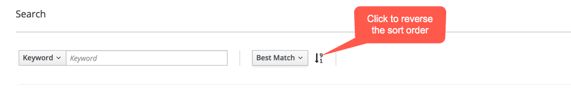

Vendors
=======

Use the `Vendors page </vendors>`_. To quickly find content available from a specific vendor.
At the top of the page is a filter toolbar that can be used to filter vendors by name and description.

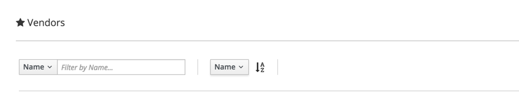

To find vendors with *micro* in the name, for example, leave the filter dropdown set to *Name*, type *micro* in the
input field, and click the Enter key to apply the filter.

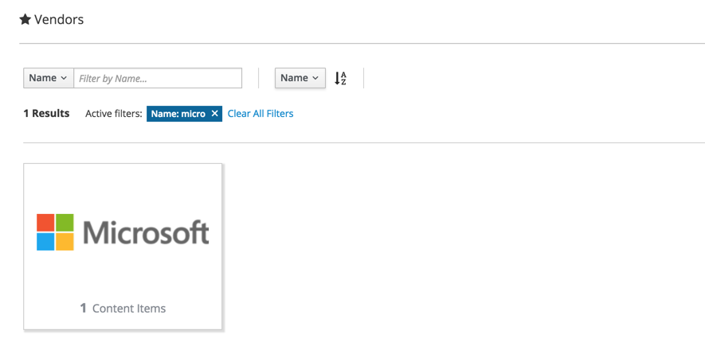

Use the sort order dropdown to change how results are ordered. By default they're ordered by *Name*. Choose from *Name* or
*Description*, as pictured below:

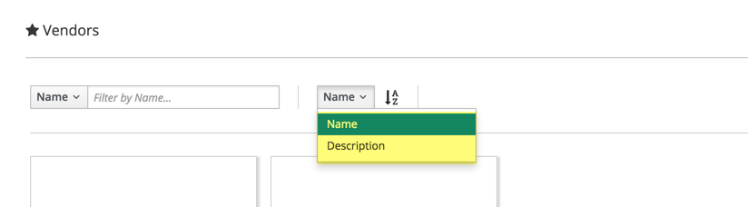

Results are returned in ascending order. Click the arrow to the right of the sort order dropdown, as indicated in the 
image below, to switch between ascending and descending order. The arrow points up to indicate ascending, and down to indicate descending.

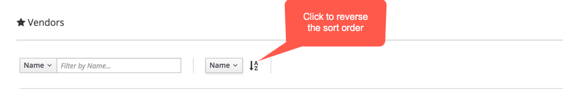

Community
=========

Use the `Community page </community>`_. To quickly find content available from a specific community
author. At the top of the page is a filter toolbar that can be used to filter authors by name and description.

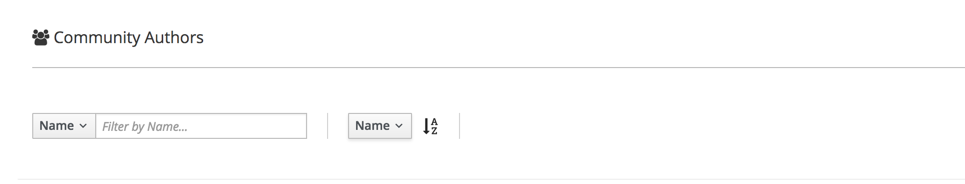

To find authors with *geerling* in the name, for example, leave the filter dropdown set to *Name*, type *geerling* in the
input field, and click the Enter key to apply the filter.

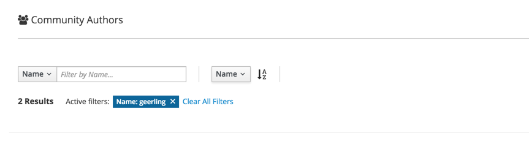

Use the sort order dropdown to change how results are ordered. By default they're ordered by *Name*. Choose from *Name* or
*Description*, as pictured below:

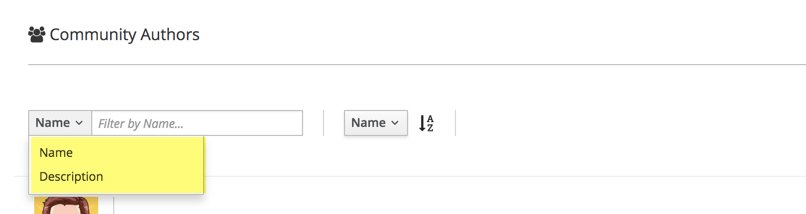

Results are returned in ascending order. Click the arrow to the right of the sort order dropdown, as indicated in the 
image below, to switch between ascending and descending order. The arrow points up to indicate ascending, and down to
indicate descending.

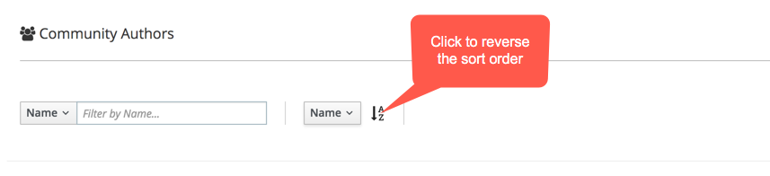
